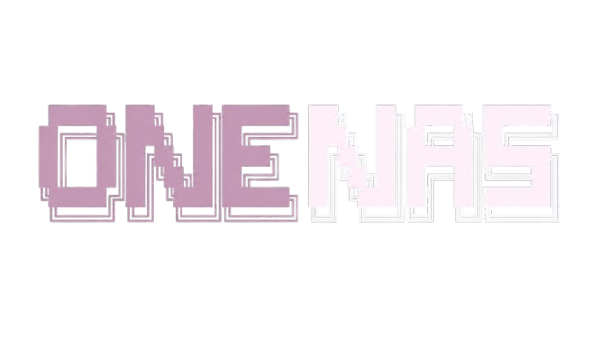

<p align="center">
  <a href="https://onenas.atlasflux.my">
    
  </a>
</p>
<p align="center">The ONeNas Code AI coding agent.</p>
<p align="center">
  <a href="https://www.npmjs.com/package/onenas-code"></a>
  <a href="https://github.com/muhdnabil66/onenas-code/actions/workflows/publish.yml"></a>
</p>

<p align="center">
  <a href="README.md">English</a> |
  <a href="README.zh.md">简体中文</a> |
  <a href="README.zht.md">繁體中文</a> |
  <a href="README.ko.md">한국어</a> |
  <a href="README.de.md">Deutsch</a> |
  <a href="README.es.md">Español</a> |
  <a href="README.fr.md">Français</a> |
  <a href="README.it.md">Italiano</a> |
  <a href="README.da.md">Dansk</a> |
  <a href="README.ja.md">日本語</a> |
  <a href="README.pl.md">Polski</a> |
  <a href="README.ru.md">Русский</a> |
  <a href="README.bs.md">Bosanski</a> |
  <a href="README.ar.md">العربية</a> |
  <a href="README.no.md">Norsk</a> |
  <a href="README.br.md">Português (Brasil)</a> |
  <a href="README.th.md">ไทย</a> |
  <a href="README.tr.md">Türkçe</a> |
  <a href="README.uk.md">Українська</a> |
  <a href="README.bn.md">বাংলা</a> |
  <a href="README.gr.md">Ελληνικά</a> |
  <a href="README.vi.md">Tiếng Việt</a>
</p>

[](https://onenas.atlasflux.my)

---

### Installation

```bash
# Using npm
npm i -g onenas-code

# Using bun
bun add -g onenas-code

# Using pnpm
pnpm add -g onenas-code

# Using yarn
yarn global add onenas-code
```

> [!TIP]
> Remove older versions before installing.

### Desktop App (BETA)

ONeNas Code is also available as a desktop application. Download from the [releases page](https://github.com/muhdnabil66/onenas-code/releases).

| Platform              | Download                           |
| --------------------- | ---------------------------------- |
| Windows               | `onenas-code-windows-x64.exe`      |

### Usage

```bash
onenas
```

### Documentation

For more info on how to configure ONeNas Code, [**head over to our docs**](https://onenas.atlasflux.my/docs).

### Contributing

If you're interested in contributing to ONeNas Code, please read our [contributing docs](./CONTRIBUTING.md) before submitting a pull request.

### Building on ONeNas Code

If you are working on a project that's related to ONeNas Code and is using "onenas" as part of its name, for example "onenas-dashboard" or "onenas-mobile", please add a note to your README to clarify that it is not built by the ONeNas Code team and is not affiliated with us in any way.

---

**Website:** [onenas.atlasflux.my](https://onenas.atlasflux.my) | **GitHub:** [github.com/muhdnabil66/onenas-code](https://github.com/muhdnabil66/onenas-code)
